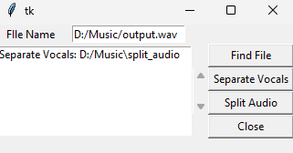

# Audio Processor and Splitter

I make This Python application with easy UI provides functionality for splitting audio files into smaller chunks and separating vocals from audio files using the Demucs library. 

## Features

- Split audio files into smaller chunks based on specified silence thresholds and durations.
- Separate vocals from audio files using the Demucs library.
- Graphical user interface (GUI) for easy interaction.

## Prerequisites

Before running the application, make sure you have the following dependencies installed:

- Python 3.x
- Tkinter (usually pre-installed with Python)
- PyTorch
- librosa
- soundfile
- numpy

You can install the required packages using the following command:

`pip install -r requirements.txt`

## Usage

1. Clone the repository or download the source code.
2. Navigate to the project directory.
3. Run the application with the following command:

`python main.py`

4. The GUI window will open.
5. Click the "Find File" button to select the audio file you want to process.
6. Click the "Separate Vocals" button to separate the vocals from the audio file.
7. Click the "Split Audio" button to split the audio file into smaller chunks.
8. The output files will be saved in the respective directories (`split_audio` and `separate_vocals`) within the same directory as the input audio file.

## Example Image

Here's an example image of the application's GUI:

## Contributing

Contributions are welcome! If you find any issues or have suggestions for improvements, please open an issue or submit a pull request.

## License

This project is licensed under the [MIT License](LICENSE).
